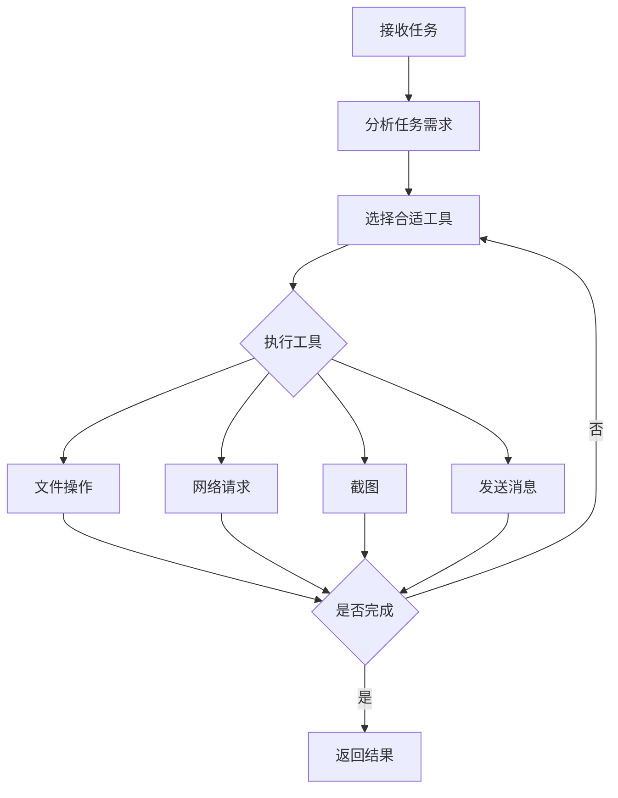

# Computer Use Agent Plugin

一个功能强大的计算机使用代理插件，为 Neo-MoFox 提供文件操作、网络请求、截图等系统级能力。

## 📋 功能特性

### 🔧 核心功能

- **文件操作**
  - 创建、读取、写入文件
  - 列出目录内容
  - 支持多种文件格式（txt, md, json, csv, log, py, js, html, css 等）
  - 所有操作限制在工作目录内，确保安全性

- **网络请求**
  - 发送 HTTP/HTTPS 请求（基于 aiohttp）
  - 支持 GET、POST 等多种请求方法
  - 自定义请求头和请求体
  - 响应大小和超时限制

- **屏幕截图**
  - 捕获全屏或指定区域
  - 支持 PNG 和 JPEG 格式
  - 可配置图片质量和尺寸
  - 自动保存到工作目录

- **消息发送**
  - 向聊天流发送消息
  - 支持文本和文件发送
  - 集成 Agent 工作流

### 🛡️ 安全特性

- **沙盒环境**: 所有文件操作限制在配置的工作目录内
- **文件大小限制**: 防止超大文件操作
- **文件类型白名单**: 仅允许指定的文件扩展名
- **网络限制**: 可配置允许的 URL 协议和响应大小
- **超时保护**: 网络请求和操作都有超时限制

## 📦 安装

### 依赖项

插件需要以下 Python 依赖：

```bash
pip install aiohttp>=3.8.0 pillow>=10.0.0 mss>=9.0.0
```

### 插件安装

1. 将插件目录放置到 Neo-MoFox 的 `plugins/` 目录下
2. 确保依赖项已安装
3. 重启 Neo-MoFox

## ⚙️ 配置

插件配置文件位于 `config/plugins/computer_use_agent/config.toml`，主要包含以下配置节：

### Plugin 配置

```toml
[plugin]
# 是否启用插件
enabled = true
```

### Security 配置

```toml
[security]
# 工作目录（绝对路径），所有文件操作限制在此目录内
workspace_directory = "e:\\delveoper\\mmc010\\Neo-MoFox\\plugins\\computer_use_agent\\workspace"

# 最大文件大小限制（MB）
max_file_size_mb = 10

# 允许操作的文件扩展名
allowed_file_extensions = [".txt", ".md", ".json", ".csv", ".log", ".py", ".js", ".html", ".css"]

# 是否允许创建子目录
enable_directory_creation = true
```

### Network 配置

```toml
[network]
# 网络请求超时时间（秒）
timeout = 30

# 最大响应大小（MB）
max_response_size_mb = 5

# 允许的 URL 协议
allowed_schemes = ["http", "https"]
```

### Screenshot 配置

```toml
[screenshot]
# 截图格式（png/jpeg）
screenshot_format = "png"

# JPEG 质量（0-100）
jpeg_quality = 85

# 最大截图宽度
max_width = 1920

# 最大截图高度
max_height = 1080
```

## 🚀 使用方法

### 基本用法

Computer Use Agent 会根据任务描述自动选择合适的工具来完成任务。只需将完整需求一次性传入即可：

```python
# 示例：下载文件并发送
task = "从 https://example.com/data.json 下载 JSON 文件，保存到工作目录，然后发送给我"
```

### 可用工具

插件提供以下工具，Agent 会自动调用：

#### 1. 文件创建 (FileCreateTool)
创建新文件并写入内容

```python
{
    "file_path": "example.txt",
    "content": "Hello, World!"
}
```

#### 2. 文件读取 (FileReadTool)
读取文件内容

```python
{
    "file_path": "example.txt"
}
```

#### 3. 文件写入 (FileWriteTool)
向现有文件写入或追加内容

```python
{
    "file_path": "example.txt",
    "content": "New content",
    "mode": "append"  # 或 "overwrite"
}
```

#### 4. 目录列表 (ListDirectoryTool)
列出目录内容

```python
{
    "directory_path": "."  # 相对于工作目录
}
```

#### 5. HTTP 请求 (CurlTool)
发送 HTTP 请求

```python
{
    "url": "https://api.example.com/data",
    "method": "GET",
    "headers": {"Authorization": "Bearer token"},
    "body": null
}
```

#### 6. 屏幕截图 (ScreenshotTool)
截取屏幕

```python
{
    "filename": "screenshot.png"
}
```

#### 7. 发送消息 (SendMessageTool)
向用户发送消息或文件

```python
{
    "message": "任务完成！",
    "file_path": "result.json"  # 可选
}
```

#### 8. 完成任务 (FinishTaskTool)
标记任务完成并返回结果

```python
{
    "result": "任务已成功完成",
    "success": true
}
```

## 📝 示例场景

### 场景 1: 下载并处理文件

```
用户: "从 https://example.com/data.json 下载文件，读取内容并发送给我"

Agent 自动执行:
1. 使用 CurlTool 下载文件
2. 使用 FileCreateTool 保存文件
3. 使用 FileReadTool 读取内容
4. 使用 SendMessageTool 发送文件
5. 使用 FinishTaskTool 完成任务
```

### 场景 2: 创建报告

```
用户: "创建一个包含系统信息的报告文件"

Agent 自动执行:
1. 收集系统信息
2. 使用 FileCreateTool 创建报告文件
3. 使用 SendMessageTool 通知用户
4. 使用 FinishTaskTool 完成任务
```

### 场景 3: 截图并发送

```
用户: "截个屏并发给我"

Agent 自动执行:
1. 使用 ScreenshotTool 截图
2. 使用 SendMessageTool 发送图片
3. 使用 FinishTaskTool 完成任务
```

## 🔍 工作流程



## 🏗️ 项目结构

```
computer_use_agent/
├── agent/                      # Agent 实现
│   ├── __init__.py
│   └── computer_use_agent.py   # 主 Agent 类
├── tools/                      # 工具集合
│   ├── __init__.py
│   ├── file_create.py          # 文件创建工具
│   ├── file_read.py            # 文件读取工具
│   ├── file_write.py           # 文件写入工具
│   ├── list_directory.py       # 目录列表工具
│   ├── curl.py                 # HTTP 请求工具
│   ├── screenshot.py           # 截图工具
│   ├── send_message.py         # 消息发送工具
│   ├── finish_task.py          # 任务完成工具
│   └── web_search.py           # 网页搜索工具
├── workspace/                  # 工作目录（可配置）
├── config.py                   # 配置定义
├── plugin.py                   # 插件入口
├── manifest.json               # 插件清单
├── __init__.py
└── README.md                   # 本文件
```

## ⚠️ 注意事项

1. **安全性**: 
   - 所有文件操作都限制在工作目录内
   - 不要在工作目录外创建符号链接
   - 谨慎配置允许的文件扩展名

2. **性能**:
   - 大文件操作可能耗时较长
   - 网络请求受超时和大小限制
   - 截图功能需要图形环境支持

3. **使用建议**:
   - 将完整需求一次性传入，不要分步调用
   - 合理设置文件大小和网络超时限制
   - 定期清理工作目录中的临时文件

## 🐛 故障排除

### 文件操作失败

- 检查工作目录是否存在且有写权限
- 确认文件扩展名在白名单中
- 检查文件大小是否超过限制

### 网络请求失败

- 检查 URL 协议是否在允许列表中
- 确认网络连接正常
- 检查超时设置是否合理

### 截图失败

- 确认运行环境支持图形界面
- 检查 mss 库是否正确安装
- 确认截图尺寸设置合理

## 📄 许可证

本插件遵循 Neo-MoFox 项目的许可证。

## 👥 贡献

欢迎提交 Issue 和 Pull Request！

## 📮 联系方式

- 项目主页: [Neo-MoFox](https://github.com/your-org/Neo-MoFox)
- 问题反馈: [Issues](https://github.com/your-org/Neo-MoFox/issues)

## 🙏 致谢

感谢所有为 Neo-MoFox 项目做出贡献的开发者！

---

**版本**: 1.0.0  
**作者**: MoFox Team  
**最后更新**: 2026-02-23
